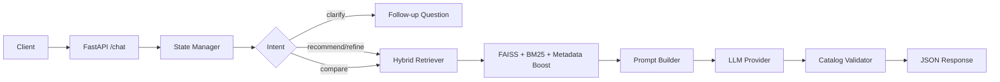

# SHL Assessment Recommender

Production-quality conversational agent that recommends **SHL Individual Test Solutions** through natural dialogue. Built for the SHL Labs AI Internship assignment with emphasis on grounded retrieval, hallucination prevention, and interview-defensible architecture.

## Architecture



### Pipeline

| Stage | Component | Purpose |
|-------|-----------|---------|
| Ingestion | `scraper/catalog_scraper.py` | Scrape SHL catalog (`type=1` Individual Tests) |
| Indexing | `scripts/build_index.py` | Sentence-transformer embeddings → FAISS |
| Retrieval | `app/retrieval/retriever.py` | Semantic + lexical hybrid ranking |
| Reasoning | `app/services/state_manager.py` | Slot filling, intent, turn limits |
| Generation | `app/services/agent.py` | Layered prompts + LLM |
| Safety | `app/utils/validation.py` | URL/name whitelist against catalog |

## Quick Start

```bash
# 1. Clone and install
pip install -r requirements.txt

# 2. Configure
cp .env.example .env
# Set LLM_PROVIDER=groq|gemini|openrouter|mock and API keys

# 3. Build catalog (scrape live SHL site)
python scraper/pipeline.py --output catalog/data/shl_catalog.json

# If scrape returns 0 (network/WAF), bootstrap from verified public dataset:
python scripts/bootstrap_catalog.py

# 4. Build vector index
python scripts/build_index.py

# 5. Run API
uvicorn main:app --host 0.0.0.0 --port 8000

# 6. Run the standalone UI
cd ui
python -m http.server 5500
```

## API

The FastAPI service exposes exactly two assignment endpoints:

- `GET /health`
- `POST /chat`

### `GET /health`

```json
{"status": "ok"}
```

### `POST /chat`

**Request**

```json
{
  "messages": [
    {"role": "user", "content": "I am hiring a Java Developer"}
  ]
}
```

**Response** (schema always enforced)

```json
{
  "reply": "...",
  "recommendations": [
    {
      "name": "Java 8 Programming",
      "url": "https://www.shl.com/solutions/products/product-catalog/view/java-8-programming/",
      "test_type": "Knowledge & Skills"
    }
  ],
  "end_of_conversation": false
}
```

## Example Conversations

**Clarification**

```
User: I need an assessment
Agent: What role are you hiring for (e.g., Java Developer, Sales Manager)?
```

**Recommendation**

```
User: I am hiring a mid-level Java Developer with Spring experience
Agent: [recommends 1-10 grounded SHL tests]
```

**Refinement**

```
User: Actually include personality tests
Agent: [updates recommendations, does not restart]
```

**Comparison**

```
User: What is the difference between OPQ and GSA?
Agent: [comparison from retrieved catalog only]
```

## UI

A standalone browser UI is available in `ui/` and does not add extra backend endpoints.

1. Start the API:
```bash
uvicorn main:app --host 0.0.0.0 --port 8000
```
2. Serve the UI:
```bash
cd ui
python -m http.server 5500
```
3. Open [http://127.0.0.1:5500](http://127.0.0.1:5500)

The UI sends the full message history on every turn, matching the stateless backend contract.

## Design Choices

1. **Stateless API** — conversation state inferred from full message history each request.
2. **Hybrid retrieval** — FAISS semantic search + BM25 lexical + metadata boosts (seniority, remote, personality).
3. **Catalog grounding** — recommendations validated against a local registry; hallucinated URLs stripped.
4. **Layered prompts** — system / conversation / retrieval / format separation.
5. **Pluggable LLM** — Groq, Gemini, OpenRouter, or mock for offline dev/tests.
6. **Modular packages** — scraper, retrieval, agent, API isolated for testability.

## Testing

```bash
pytest -q
```

Covers schema compliance, clarification flow, injection refusal, off-topic handling, and hallucination prevention.

## Deployment

**Docker**

```bash
docker build -t shl-recommender .
docker run -p 8000:8000 --env-file .env shl-recommender
```

**Render** — use included `render.yaml` and set `LLM_PROVIDER` + API keys in dashboard.

## Tradeoffs

| Choice | Benefit | Cost |
|--------|---------|------|
| FAISS (local) | Fast, no external DB | Rebuild index on catalog change |
| Rule-based state + LLM | Predictable clarification | Less flexible than full agent framework |
| Mock LLM default | Zero-cost local dev | Weaker natural language without API key |
| Catalog bootstrap fallback | Reliable cold start | Secondary source when live scrape blocked |

## Future Improvements

- Cross-encoder reranker (e.g., `bge-reranker-base`)
- Async detail-page scraping with connection pooling
- Recall@10 evaluation harness with labeled query set
- Streaming `/chat` responses
- Redis-free caching of embeddings per query cluster

## Project Structure

```
app/           # FastAPI, agent, retrieval, LLM, prompts
scraper/       # SHL catalog ingestion
catalog/data/  # Structured JSON dataset
vectorstore/   # FAISS index + metadata
scripts/       # build_index, bootstrap_catalog
tests/         # Unit and API tests
docs/          # Architecture and approach documents
```

See `docs/APPROACH.md` and `docs/ARCHITECTURE.md` for deeper technical rationale.
