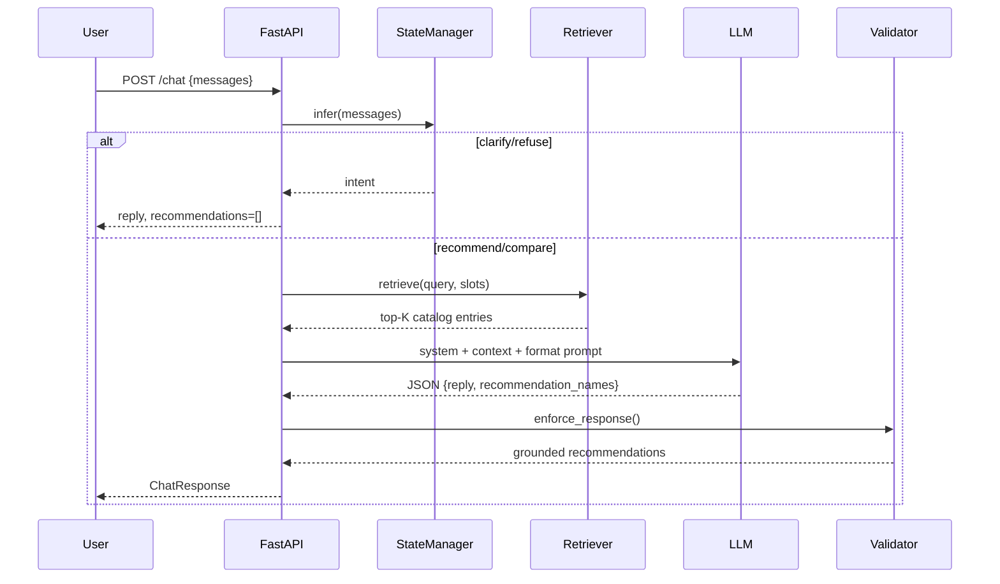

# Architecture Document

## System Overview

The SHL Assessment Recommender is a **retrieval-augmented conversational agent** with a strict grounding contract: every recommended product must exist in a locally verified catalog with a canonical SHL URL.

## Component Justification

### 1. Scraper (`scraper/catalog_scraper.py`)

- **Why**: Assignment requires automated ingestion of the complete Individual Test Solutions catalog.
- **How**: Paginates `?start=<offset>&type=1`, parses listing table, enriches each `/view/` detail page.
- **Output**: Structured `AssessmentRecord` JSON with name, URL, description, test type, duration, remote/adaptive flags, inferred skills/keywords.

### 2. Embedding Index (`app/retrieval/embedder.py`, `scripts/build_index.py`)

- **Why**: Naive keyword search fails on semantic queries like "hire someone who thinks analytically under pressure."
- **Model**: `sentence-transformers/all-MiniLM-L6-v2` — strong speed/quality tradeoff for deployment.
- **Store**: FAISS `IndexFlatIP` with normalized vectors for cosine similarity via inner product.

### 3. Hybrid Retriever (`app/retrieval/retriever.py`)

Combines three signals:

| Signal | Weight | Rationale |
|--------|--------|-----------|
| Semantic (FAISS) | 0.55 | Captures intent beyond exact keywords |
| Lexical (BM25) | 0.25 | Handles exact skill tokens (Java, OPQ) |
| Metadata boost | 0.20 | Applies slot constraints (remote, personality) |

### 4. State Manager (`app/services/state_manager.py`)

- **Why**: Stateless API must infer clarification readiness from history alone.
- **Slots**: role → seniority → technical domain → objective → soft skills → leadership → personality → language → domain → constraints.
- **Guards**: injection patterns, off-topic refusal, max 8 user turns.

### 5. Agent (`app/services/agent.py`)

Orchestrates intent routing:

```
messages → state → [clarify | refuse | compare | retrieve → generate → validate]
```

### 6. Catalog Validator (`app/utils/validation.py`)

- **Why**: LLMs hallucinate URLs even with RAG.
- **How**: Post-generation whitelist by canonical URL, slug, and exact name.

### 7. LLM Abstraction (`app/llm/`)

Provider interface with Groq, Gemini, OpenRouter, and mock implementations for testability.

## Sequence Diagram



## Hallucination Prevention Stack

1. Retrieve before recommend — no catalog context → no products.
2. Prompt constraint — names must match retrieved context.
3. Deterministic validator — strips unknown URLs/names.
4. Comparison mode — recommendations always `[]`; prose grounded in retrieval only.

## Configuration

All secrets and paths via `.env` (see `.env.example`). No hardcoded API keys.
